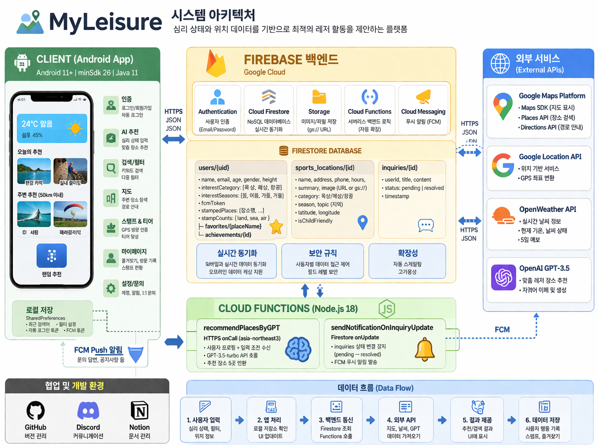

# 🏅 MyLeisure - 레저스포츠 맞춤형 추천 플랫폼

## 🎯 프로젝트 소개

🏷 **프로젝트 명 : MyLeisure**

🗓️ **프로젝트 기간 : 2025.03 ~ 2025.09**

👥 **구성원 : 김태혁(팀장👑), 박영민, 한솔웅**

---

### ✅ 기획 배경

> "내 기분에 딱 맞는 레저 활동을, 지금 바로"

레저스포츠를 즐기고 싶지만 어떤 활동을 선택할지 고민하는 사람들을 위해 기획하였습니다.
사용자가 현재 기분·에너지 수준 및 그룹 구성을 입력하면 AI가 최적의 레저 활동을 추천하고,
GPS 기반으로 주변 장소를 탐색하며 실시간 날씨까지 반영해 활동 가능 여부를 안내합니다.

---

### ✅ 서비스 소개

> 심리 상태와 위치 데이터를 기반으로 최적의 레저 활동을 제안하는 안드로이드 애플리케이션

- 스릴 난이도, 실내/실외, 인원·나이대를 입력하면 GPT 기반 AI가 맞춤 레저 장소 5곳을 추천해준다.
- GPS와 Google Maps API를 활용해 현재 위치 반경 50km 이내 장소를 탐색할 수 있다.
- OpenWeather API로 현재 기온·날씨 상태를 실시간으로 홈 화면에 표시한다.
- 유형(육상/해상/항공)·계절·지역 다중 필터와 주사위 랜덤 추천 기능을 제공한다.
- 실제 장소 방문 시 GPS로 100m 반경을 검증해 스탬프를 적립하고 티어를 달성할 수 있다.

---

### 👥 서비스 대상

- 레저·스포츠 활동을 즐기고 싶지만 어떤 활동을 선택해야 할지 고민하는 사람들
- 현재 위치 주변의 레저 장소를 편리하게 찾고 싶은 사람들

---

## 🛠 기술 스택

### Mobile

<p>
  
  
  
  
</p>

### Firebase

<p>
  
  
  
  
  
</p>

### External API

<p>
  
  
  
  
</p>

### Library

<p>
  
  
  
  
</p>

### Cloud Functions Runtime

<p>
  
  
</p>

### Collaboration

<p>
  
  
  
  <a href="https://www.figma.com/design/04cgX2L62RWBZBzkJvGHq3/leisure?node-id=1-2&p=f&t=GZkoIRCbF1iNQCc0-0" target="_blank">
    
  </a>
</p>

---

## 💌 서비스 화면 및 기능 소개

### ✅ 온보딩 / 로그인

- **온보딩**
  > 앱 최초 실행 시 자동 로그인 여부를 확인하여 홈 또는 로그인 화면으로 분기한다.


- **로그인 / 회원가입**
  > 이메일·비밀번호로 Firebase Auth 기반 로그인 및 회원가입이 가능하다. 자동 로그인 설정 시 FCM 토큰을 Firestore에 등록한다.


- **회원가입 프로필 설정**
  > 나이, 성별, 관심 스포츠 카테고리(육상·해상·항공), 선호 계절, 키를 단계별로 입력한다. 이 정보는 GPT 추천 프롬프트의 기반 데이터로 활용된다.


---

### ✅ 메인 홈

- **홈 화면**
  > 현재 위치 기반 실시간 날씨(OpenWeather API), 오늘의 추천 2곳, 주변 50km 이내 추천 2곳, 주사위 랜덤 추천을 한눈에 확인할 수 있다.

> 주사위를 클릭하면 슬롯 애니메이션 후 랜덤 레저 장소 1곳이 선정된다.


---

### ✅ 심리 기반 AI 추천

- **감정/상황 입력**
  > 스릴 난이도(낮음·보통·높음), 장소 선호(실내·실외), 인원 수, 인원별 연령대, 어린이 동반 여부를 선택한다.


- **AI 추천 결과**
  > Firebase Cloud Functions를 통해 GPT-3.5-turbo에 사용자 프로필(신장, 관심사, 선호 계절) + 입력 조건을 전달해 맞춤 레저 장소 5곳을 추천받는다.


---

### ✅ 검색 및 필터링

- **키워드 검색**

  > 장소명 키워드 검색과 최근 검색어 관리(SharedPreferences)를 지원한다.

- **다중 필터**
  > 유형(category), 계절(season), 지역(topic) 조건을 조합해 Firestore `sports_locations` 컬렉션에서 복합 필터 검색을 수행한다.


---

### ✅ 장소 상세 / 지도

- **장소 상세**
  > 장소명·이미지(Firebase Storage gs:// URL 지원)·주소·전화·운영 시간·이용 요금·요약 정보를 표시한다.
  > 즐겨찾기(Firestore users/{uid}/favorites), 전화 연결, 지도 이동, 스탬프 찍기가 가능하다.


- **지도**
  > Google Maps 위에 주변 레저 장소 마커를 표시하고, 장소 상세에서 진입 시 해당 좌표로 지도를 중심화한다.


---

### ✅ 스탬프 & 티어

- **GPS 스탬프 수집**

  > 장소 100m 반경 내에서 스탬프 버튼을 누르면 Firestore에 방문 기록이 누적된다. 카테고리(육상·해상·항공)별로 스탬프 횟수가 관리된다.

- **티어 달성**
  > 스탬프 3·6·9·12·15개 달성 시 Bronze → Silver → Gold → Platinum → Master 티어가 자동으로 기록된다.

> 달성한 티어는 `users/{uid}/achievements` 서브컬렉션에 저장되며 중복 달성은 방지된다.


---

### ✅ 마이페이지

- **즐겨찾기 / 방문 기록**
  > 찜한 장소 목록과 방문한 장소 이력을 카드 형태로 조회할 수 있다.


---

### ✅ 설정

- **계정 관리**

  > 내 정보 조회, 비밀번호 변경, 관심 종목 수정, 푸시 알림 설정, 회원 탈퇴를 제공한다.

- **고객 지원**
  > 공지사항 확인, 1:1 문의 접수 및 내역 조회가 가능하다. 문의가 처리 완료(pending → resolved)되면 FCM 푸시 알림이 발송된다.


---

## 🏗 시스템 아키텍처



---

## 🗂 프로젝트 구조

```
app/src/main/java/com/example/capstonedesign/
│
├── login_signup/                         # 인증 및 회원가입 플로우
│   ├── OnboardingActivity.java           # 앱 진입점 - 자동 로그인 분기
│   ├── LoginActivity.java                # 이메일/비밀번호 로그인, FCM 토큰 등록
│   ├── SignUpActivity.java               # 회원가입
│   ├── FindPwActivity.java               # 비밀번호 찾기
│   ├── AgeInputActivity.java             # 나이 입력
│   ├── GenderSelectActivity.java         # 성별 선택
│   ├── SportsSelectActivity.java         # 관심 스포츠 선택 (육상/해상/항공)
│   ├── SeasonSelectActivity.java         # 선호 계절 선택
│   └── InputHeightActivity.java          # 키 입력 (GPT 추천 데이터)
│
├── settings_information/                 # 설정 및 마이페이지
│   ├── SettingsActivity.java             # 설정 메인
│   ├── InformationActivity.java          # 내 정보 조회
│   ├── AccountInfoActivity.java          # 계정 정보
│   ├── PasswordChangeActivity.java       # 비밀번호 변경
│   ├── InterestChangeActivity.java       # 관심 종목 수정
│   ├── PushSettingActivity.java          # 푸시 알림 설정
│   ├── WithdrawActivity.java             # 회원 탈퇴
│   ├── NoticeActivity.java               # 공지사항 목록
│   ├── InquiryHistoryActivity.java       # 문의 내역 조회
│   ├── MyFirebaseMessagingService.java   # FCM 수신 서비스
│   ├── Notice.java                       # 공지사항 데이터 모델
│   └── NoticeAdapter.java                # 공지사항 RecyclerView 어댑터
│
├── util/
│   └── FilterPrefs.java                  # 필터 조건 SharedPreferences 관리
│
├── MainActivity.java                     # 홈 화면 (날씨, 오늘 추천, 주변 추천, 랜덤 추천)
├── FeelingInputActivity.java             # 심리 상태 입력 (스릴/장소/인원/나이대)
├── RecommendationResultActivity.java     # GPT AI 추천 결과 화면
├── SearchActivity.java                   # 키워드 검색 + 최근 검색어 관리
├── SearchFilterActivity.java             # 검색 다중 필터 설정
├── FilterActivity.java                   # 일반 필터 설정
├── PlaceDetailActivity.java              # 장소 상세, 즐겨찾기, GPS 스탬프, 전화
├── MapActivity.java                      # Google Maps 주변 장소 마커 표시
├── TodayRecommendActivity.java           # 오늘의 추천 전체 목록
├── NearbyRecommendActivity.java          # 50km 이내 주변 추천 전체 목록
├── FavoriteListActivity.java             # 즐겨찾기(찜) 목록
├── VisitedListActivity.java              # 방문 기록 목록
├── StampActivity.java                    # 스탬프 컬렉션 현황
├── TierAnalysisActivity.java             # 카테고리별 티어 분석
├── ContactActivity.java                  # 1:1 문의 접수
│
├── Achievement.java                      # 뱃지/티어 달성 데이터 모델
├── Inquiry.java                          # 문의 데이터 모델 (pending/resolved)
├── VisitedPlace.java                     # 방문 장소 데이터 모델
│
├── AchievementAdapter.java               # 티어 뱃지 RecyclerView 어댑터
├── RecommendationAdapter.java            # 추천 장소 카드 어댑터
├── SearchResultAdapter.java              # 검색 결과 어댑터
├── RecentSearchAdapter.java              # 최근 검색어 어댑터
├── InquiryAdapter.java                   # 문의 목록 어댑터
└── VisitedListAdapter.java               # 방문 기록 어댑터

functions/                                # Firebase Cloud Functions (Node.js 18)
├── index.js                              # GPT 추천 함수 / 문의 FCM 알림 트리거
└── package.json                          # firebase-admin, firebase-functions, axios
```

---

## 📜 프로젝트 산출물

### Firestore 데이터 구조

```
Firestore Database
│
├── users/{uid}
│   ├── name, email, age, gender, height
│   ├── interestCategory: ["육상", "해상", "항공"]   ← GPT 추천 프롬프트에 사용
│   ├── interestSeasons:  ["봄", "여름", "가을", "겨울"]
│   ├── fcmToken                                     ← FCM 푸시 알림용
│   ├── stampedPlaces: ["장소명", ...]               ← 중복 스탬프 방지
│   ├── stampCounts: { land: 0, sea: 0, air: 0 }    ← 카테고리별 스탬프 횟수
│   │
│   ├── favorites/{placeName}
│   │   └── name, address, phone
│   │
│   └── achievements/{id}
│       └── tier, category, timestamp               ← Bronze/Silver/Gold/Platinum/Master
│
├── sports_locations/{id}
│   ├── name, address, phone, hours, price, summary
│   ├── image                                        ← URL 또는 gs:// Firebase Storage 경로
│   ├── category: "육상" | "해상" | "항공"
│   ├── season, topic (지역)
│   ├── latitude, longitude                          ← GPS 스탬프 거리 검증용
│   └── isChildFriendly
│
└── inquiries/{id}
    ├── userId, title, content
    ├── status: "pending" | "resolved"              ← resolved 시 FCM 알림 트리거
    └── timestamp
```

### Cloud Functions

| 함수명                            | 트리거             | 리전            | 설명                                                                              |
| --------------------------------- | ------------------ | --------------- | --------------------------------------------------------------------------------- |
| `recommendPlacesByGPT`            | HTTPS onCall       | asia-northeast3 | 사용자 프로필(신장·관심사·선호계절) + 조건으로 GPT-3.5-turbo에 장소 5곳 추천 요청 |
| `sendNotificationOnInquiryUpdate` | Firestore onUpdate | -               | `inquiries` 문서 상태가 `pending → resolved`로 변경되면 FCM 푸시 알림 발송        |

### 스탬프 티어 기준

| 스탬프 횟수 |    티어     |
| :---------: | :---------: |
|     3개     |  🥉 Bronze  |
|     6개     |  🥈 Silver  |
|     9개     |   🥇 Gold   |
|    12개     | 💎 Platinum |
|    15개     |  👑 Master  |

---

## 💙 팀원 소개

|            김태혁(팀장👑)            |             박영민              |         한솔웅          |
| :----------------------------------: | :-----------------------------: | :---------------------: |
|             Backend / DB             |            Frontend             |          UI/UX          |
|  Firebase 설계 및 Firestore DB 구축  | 홈 화면 (날씨·추천·랜덤 주사위) |    전체 UI/UX 디자인    |
| Cloud Functions (GPT 추천, FCM 알림) |  검색 / 다중 필터 / 지도 기능   | XML 레이아웃 전체 제작  |
|  Firebase Auth (로그인·자동로그인)   |      장소 상세 / 즐겨찾기       | 아이콘 및 그래픽 리소스 |
|    GPS 스탬프 & 티어 달성 시스템     |   스탬프·티어·방문 기록 화면    |                         |
|     회원가입 프로필 설정 플로우      |    마이페이지·설정·문의 화면    |                         |
